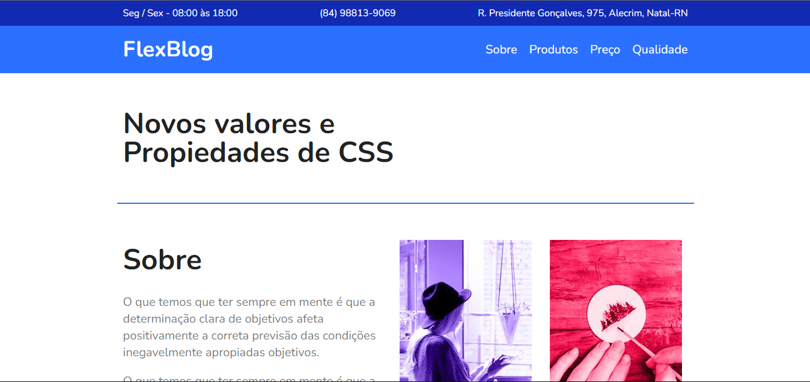

  

## 🖥️ Projeto 
Esse é um projeto Web Reponsivo de um blog feito com conceitos de flexbox.

## 🚀 Tecnologias 
Esse projeto foi desenvolvido com as aulas do curso de Flexbox da Origamid.

- HTML
- CSS
- Git e Github

